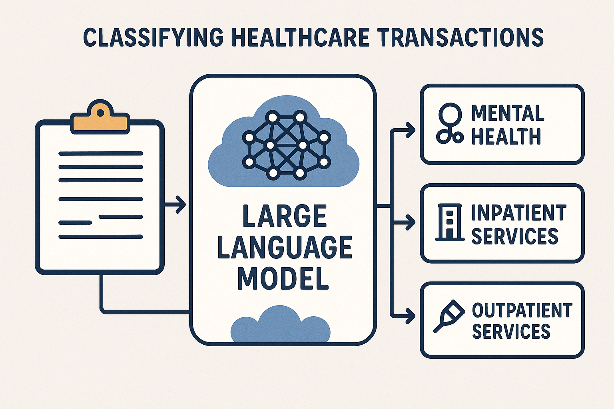

    

<!-- ABOUT THE PROJECT -->
## About The Project

*Introduction:* There is growing interest among policymakers to understand trends in private equity ownership of US health care facilities. Zhu et al. and Thornburg et al. have quantified penetration and acquisition trends among behavioral health facilities by private equity firms. However, no research to date has assessed the impact of ownership status on mental health access, quality, spending, or patient outcomes. Therefore, this study proposes to create a database of private equity transactions involving behavioral health facilities from 2010-2024 using Pitchbook data. 

*Data:* We have access to mergers and acquisitions data from PitchBoook, Inc., which is a company that tracks private equity deal data. The data allow users to search via keywords and categories to identify mergers/acquisitions and companies of interest. We have identified both inpatient and outpatient facilities that are listed in Pitchbook and likely private-equity related. For example, the outpatient facility data include 2,797 companies and 5,824 deals from 2010-2024. The data frame of inpatient facility data are of similar size. Each row in the data represent a company or deal, and the data include a description of the company/deal in addition to a URL.

*LLM-based classification:* The goal of this project is to evaluate the extent to which a large language model can be used to classify these transactions.  The PitchBook database contains a paragraph of text describing the transactions.  We plan to create a prompting workflow that will attempt to automatically recognize, based on these paragraphs, which deals relate to mental health facilities.

## Install locally with Docker
The most convenient way to get started with this repository is to run the 
code examples in a [Docker](https://docs.docker.com/) container.

The Dockerfile and docker-compose.yml files included in the repository can be 
used to create a Docker image and run a Docker container, which together provide a 
reproducible Python development.

Here's a step-by-step guide on how to use this setup:

1. Install [Docker](https://docs.docker.com/) on your machine.
2. Clone the GitHub project repository to download the contents of the repository.
3. Navigate to the repository's directory.
4. Build the Docker image. Use the command `docker compose build` to build a Docker image from the 
Dockerfile in the current directory. This image will include all the specifications from the Dockerfile.
5. Run `docker compose up` to start the Docker container based on the configurations 
in the docker-compose.yml file.
6. Access Jupyter Lab: Click on the link that starts with `localhost:8888` provided by the 
output of the last command.

(<a href="#readme-top">back to top</a>)

